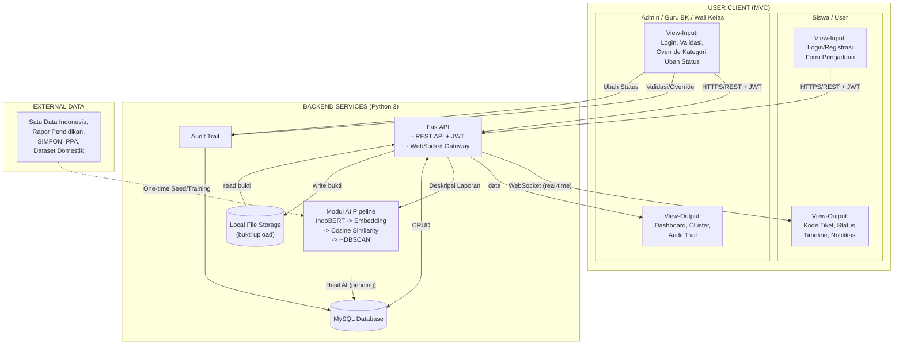
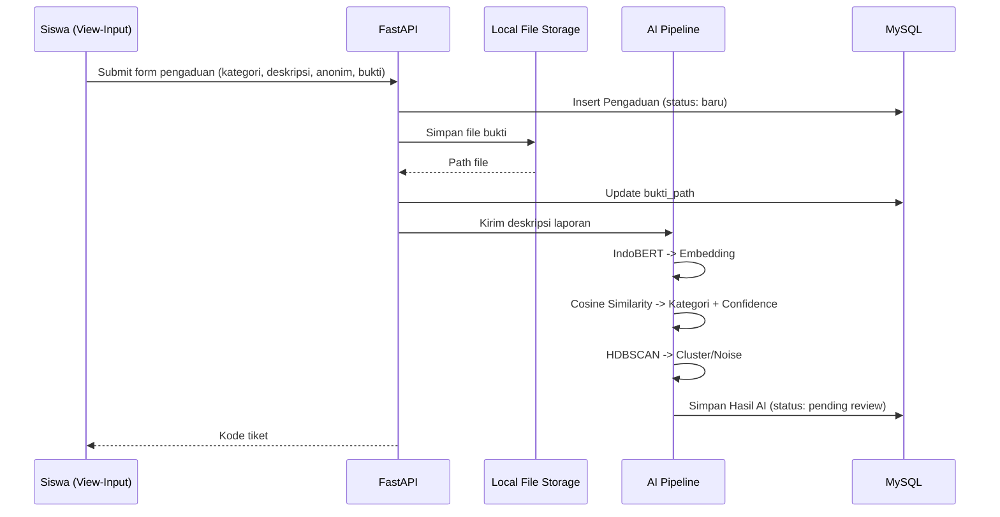
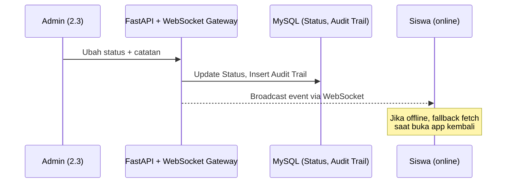

# Alur Detail Arsitektur SIGAP (Revisi)

Dokumen ini menjabarkan alur input → proses → output → tujuan untuk setiap fitur di arsitektur SIGAP, sebagai detail tambahan dari diagram `Arsitektur_SIGAP.drawio` yang sudah ada. Setelah dicek, alur ini bisa dipakai untuk update diagram.

---

## 0. Diagram Arsitektur Keseluruhan (Revisi)



---

## 1. USER CLIENT — SISWA / USER

### 1.1 Login / Registrasi
| | |
|---|---|
| **Input** | NISN/email + password (login) atau data pendaftaran (registrasi) |
| **Proses** | `FastAPI /auth` → validasi kredensial → cek role di tabel `Users` (MySQL) → generate JWT |
| **Output** | Token JWT disimpan di client state/cache → redirect ke dashboard siswa |
| **Tujuan** | Autentikasi pengguna + penentuan hak akses (RBAC) |

### 1.2 Form Pengaduan
| | |
|---|---|
| **Input** | Kategori pengaduan (opsional), Deskripsi kejadian (teks), Anonim/Non-anonim, Upload bukti (file) |
| **Proses** | 1. `FastAPI /pengaduan` terima payload → insert ke tabel `Pengaduan` (status: *baru*)<br>2. File bukti ditulis ke **Local File Storage** di server → path-nya disimpan di kolom `bukti_path` (tabel Pengaduan)<br>3. Teks deskripsi dikirim ke **Modul AI Pipeline**:<br> &nbsp;&nbsp;a. IndoBERT → encode jadi Vector Embedding<br> &nbsp;&nbsp;b. Embedding → Cosine Similarity vs embedding kategori referensi → **Kategori Rekomendasi + Confidence Score**<br> &nbsp;&nbsp;c. Embedding → HDBSCAN vs embedding laporan lain → **Cluster ID / Noise**<br>4. Hasil AI (kategori rekomendasi, confidence score, cluster id) disimpan ke tabel `Hasil AI`, status **"pending review"** |
| **Output** | Kode tiket unik dikembalikan ke siswa |
| **Tujuan** | Pengaduan tercatat, terklasifikasi otomatis, siap direview admin |



### 1.3 Tracking (Status, Timeline, Riwayat, Notifikasi)
| | |
|---|---|
| **Input** | Kode tiket / sesi login siswa |
| **Proses** | `FastAPI` query `Pengaduan` + `Status` (join by ticket_id) → ambil histori dari `Audit Trail`. Saat admin ubah status (lihat 2.3), backend broadcast event lewat **WebSocket** ke client siswa yang online |
| **Output** | Timeline penanganan, status terkini, notifikasi real-time (fallback: fetch manual saat buka app jika sempat offline) |
| **Tujuan** | Transparansi progres ke pelapor, tanpa membuka identitas jika anonim |



---

## 2. USER CLIENT — ADMIN / GURU BK / WALI KELAS

### 2.1 Login
Sama seperti 1.1, tapi role berbeda → RBAC arahkan ke view Admin.

### 2.2 Validasi Pengaduan & Konfirmasi/Override Kategori AI
| | |
|---|---|
| **Input** | Admin buka daftar pengaduan status "pending review" → lihat rekomendasi kategori AI + confidence score + cluster info |
| **Proses** | Admin **approve** (pakai kategori AI) atau **override** (pilih kategori manual) → `FastAPI /pengaduan/{id}/validasi` → update kolom `Kategori Final` |
| **Output** | `Kategori Final` tersimpan, event tercatat di `Audit Trail` (siapa, kapan, keputusan apa) |
| **Tujuan** | AI hanya sebagai *decision support* — keputusan akhir tetap manual oleh admin |

### 2.3 Perubahan Status & Catatan Penanganan
| | |
|---|---|
| **Input** | Status baru (diproses → ditindaklanjuti → selesai) + catatan tindakan |
| **Proses** | `FastAPI` update tabel `Status` → insert ke `Audit Trail` → trigger broadcast **WebSocket** ke siswa terkait |
| **Output** | Status ter-update, riwayat tersimpan, siswa dapat notifikasi real-time |
| **Tujuan** | Siswa bisa melihat progres penanganan secara langsung |

### 2.4 Dashboard Statistik / Cluster / Laporan Serupa
| | |
|---|---|
| **Input** | Filter (rentang waktu, kategori, kelas, dll) |
| **Proses** | `FastAPI` agregasi dari MySQL + hasil clustering HDBSCAN ("laporan serupa") → dirender via ECharts di frontend |
| **Output** | Grafik statistik, daftar cluster laporan serupa |
| **Tujuan** | Deteksi tren/pola kasus, early warning untuk kasus berulang dalam satu cluster |

---

## 3. BACKEND — Alur Modul AI Pipeline (detail pipa data)

```
Deskripsi Laporan (teks)
   └─> IndoBERT (encode) ──> Vector Embedding
          ├─> Cosine Similarity vs embedding kategori referensi ──> Kategori Rekomendasi + Confidence Score
          └─> HDBSCAN vs embedding laporan lain ──> Cluster ID / Noise
   └─> [keduanya] disimpan ke tabel Hasil AI, status "pending review"
   └─> Admin Validasi (approve / override)
   └─> Kategori Final tersimpan ke Pengaduan ──> trigger notifikasi WebSocket ke siswa
```

---

## 4. BACKEND — Komponen & Jalur Tambahan

### 4.1 Local File Storage (komponen baru)
- Sejajar dengan MySQL Database di dalam Group Backend.
- **Write path**: FastAPI menerima file upload bukti (dari 1.2) → tulis ke local storage server (mis. folder `/uploads`).
- **Read path**: saat admin/siswa minta lihat bukti → FastAPI baca dari local storage → kirim ke client.
- Catatan: karena disimpan lokal di satu server, jika nanti backend di-scale ke multi-instance, file perlu shared volume (NFS dsb) — cukup jadi catatan kecil, bukan bagian utama diagram.

### 4.2 WebSocket Gateway (komponen baru)
- Terpisah dari REST API endpoint biasa.
- Menangani broadcast event real-time: perubahan status (2.3) → notifikasi ke siswa (1.3).
- Jalur komunikasi kedua antara **USER CLIENT ↔ BACKEND**, selain `HTTPS/REST API + JWT`.

### 4.3 Audit Trail
- Dipicu dari **dua titik**: validasi/override kategori (2.2) dan perubahan status (2.3).
- Fungsinya sebagai log historis siapa melakukan apa dan kapan.

---

## 5. EXTERNAL DATA — Sifat Integrasi

- Sumber: Satu Data Indonesia, Rapor Pendidikan/Kemendikbudristek, SIMFONI PPA (referensi), Dataset domestik/seed.
- **Sifat: One-time seed/training data** — dipakai sekali di fase inisialisasi untuk membangun/melatih embedding referensi kategori (cold start), **bukan** sinkronisasi berkala/realtime.
- Di diagram, jalur ini sebaiknya digambar dengan **garis putus-putus (dashed)** dan label "One-time Seed/Training (fase inisialisasi)", untuk membedakan dari alur data operasional harian (REST API, WebSocket, CRUD).
- Implikasi: penambahan kategori baru atau retrain model jadi proses manual terpisah di kemudian hari (bisa dicatat sebagai future work).

---

## 6. Ringkasan Perubahan vs Diagram Lama

| No | Perubahan | Alasan |
|---|---|---|
| 1 | Tambah jalur **WebSocket** (Client ↔ Backend), selain REST API | Notifikasi status real-time ke siswa |
| 2 | Pecah **AI Pipeline** jadi 2 cabang eksplisit (Cosine Similarity & HDBSCAN) → gabung di "Hasil AI (pending)" | Alur AI lebih jelas dan detail |
| 3 | Tandai **External Data** dengan garis dashed + label "One-time Seed/Training" | Bedakan dari alur data operasional |
| 4 | Tambah komponen **Local File Storage** di Backend | Detail penyimpanan bukti upload |
| 5 | **Audit Trail** ditandai sebagai titik yang dipicu dari 2 sumber (validasi kategori & perubahan status) | Kejelasan siapa memicu log |
