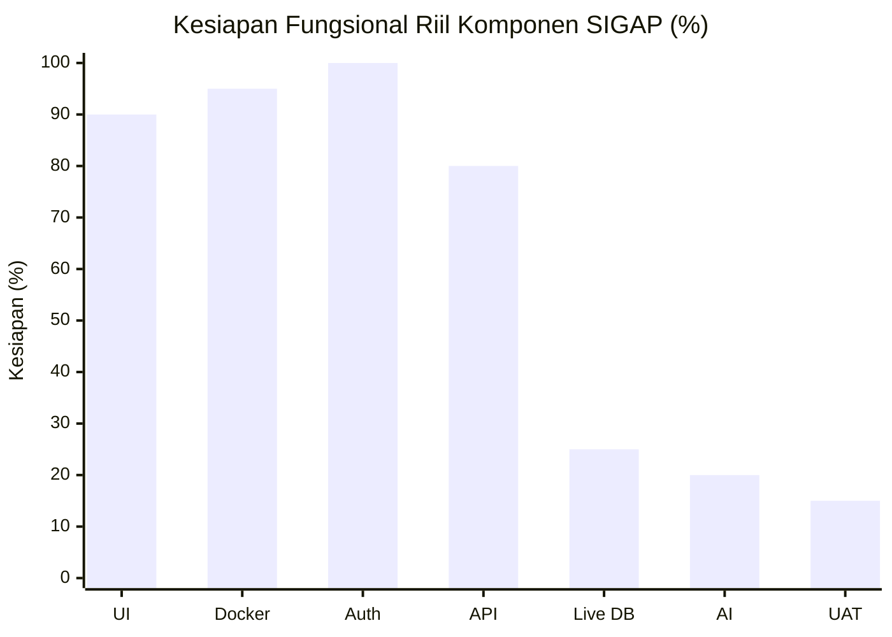
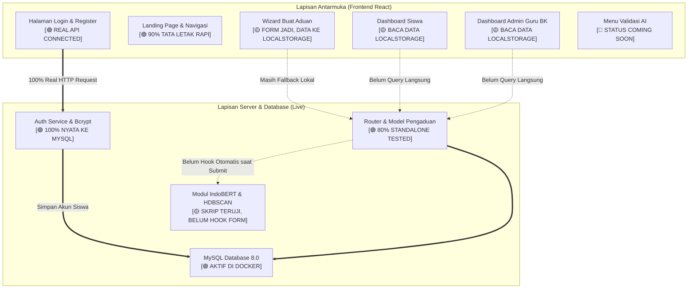
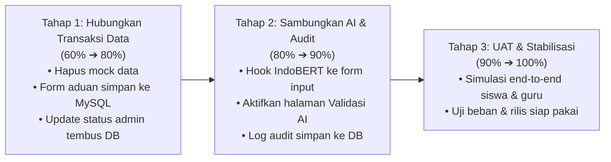

# LAPORAN PROGRES PENGEMBANGAN SISTEM SIGAP
**Sistem Informasi Gawat Aduan Perundungan**  
*Executive Presentation & Status Report — Evaluasi Realistis Oktober 2026*

---

## 1. Executive Summary (Evaluasi Realistis)

Laporan ini menyajikan status pencapaian pengembangan sistem perangkat lunak **SIGAP** secara objektif, transparan, dan berbasis kesiapan teknis nyata (*engineering readiness*), **tanpa memasukkan dokumen paper akademik/LaTeX** dan **tanpa memperhitungkan data tiruan (*mock/localStorage*)**.

Secara visual, sistem tampak seperti telah rampung ~85% karena seluruh antarmuka (UI) sudah dapat diklik dan diperagakan. Namun, secara **kesiapan fungsional nyata (*real production readiness*)**, progres proyek saat ini berada pada:

```
   STATUS REALISTIS SISTEM: 60%
   [██████████████████████████████░░░░░░░░░░░░░░░░░░░░] 60%
   
   Sudah Berfungsi Nyata (UI, Docker, DB, Auth JWT, API Standalone) : 60%
   Sisa Pekerjaan Kritis (Live CRUD Aduan, Hook AI Real-time, UAT) : 40%
```

> **Catatan Kunci Evaluasi:**
> - **Prototipe / UI Demo**: **~85%** (Tampilan lengkap, navigasi mulus, tata letak rapi di zoom 100%).
> - **Sistem Nyata End-to-End**: **60%** (Autentikasi sudah tembus database MySQL, namun transaksi aduan utama di frontend masih bergantung pada *localStorage* & simulasi data).

---

## 2. Statistik & Diagram Progres Komponen

### A. Grafik Realistis per Komponen Sistem



**Keterangan Sumbu X & Statistik Visual:**

| Kode | Komponen | Progres | Bar Visual | Status |
|:---:|---|:---:|---|:---:|
| **Auth** | Autentikasi Siswa & Admin (JWT) | **100%** | `[████████████████████]` | 🟢 Live MySQL |
| **Docker** | Infrastruktur 4 Kontainer | **95%** | `[███████████████████░]` | 🟢 Stabil |
| **UI** | Tampilan Antarmuka & Responsif | **90%** | `[██████████████████░░]` | 🟢 Siap Visual |
| **API** | Backend Standalone & 58 Tests | **80%** | `[████████████████░░░░]` | 🟢 Endpoint Siap |
| **Live DB**| Integrasi Form Aduan ke MySQL | **25%** | `[█████░░░░░░░░░░░░░░░]` | 🔴 Masih Mock |
| **AI** | Model NLP IndoBERT & HDBSCAN di UI| **20%** | `[████░░░░░░░░░░░░░░░░]` | 🔴 Simulasi Acak |
| **UAT** | Pengujian Lapangan Pengguna | **15%** | `[███░░░░░░░░░░░░░░░░░]` | 🔴 Belum UAT |

---

### B. Pemetaan Sistem: Data Nyata vs Simulasi (*Mock*)



---

## 3. Matriks Statistik Rinci (Bobot & Capaian)

| No | Pilar Pengembangan | Bobot | Progres Riil | Kontribusi | Status Operasional |
|:--:|---|:---:|:---:|:---:|:---:|
| 1 | **Tampilan Antarmuka (UI/UX & Responsif Desktop)** | 20% | **90%** | 18.0% | 🟢 Visual siap, layout zoom 100% rapi |
| 2 | **Infrastruktur & Kontainerisasi (Docker Stack)** | 10% | **95%** | 9.5% | 🟢 4 kontainer stabil (`sigap-dev.sh` aktif) |
| 3 | **Modul Autentikasi Pengguna (Siswa & Admin)** | 15% | **100%** | 15.0% | 🟢 Real JWT, verifikasi password hash di DB |
| 4 | **Logika Server & Basis Data (FastAPI + MySQL)** | 20% | **80%** | 16.0% | 🟢 Endpoint siap, 58 unit tests lulus |
| 5 | **Integrasi Transaksi Aduan (Live CRUD tanpa Mock)** | 20% | **25%** | 5.0% | 🔴 Kritis: Form masih simpan di browser |
| 6 | **Penerapan Model AI (IndoBERT & HDBSCAN di UI)** | 10% | **20%** | 2.0% | 🔴 Skor AI di UI masih Math.random() |
| 7 | **Pengujian Sistem Lapangan (UAT & Keandalan)** | 5% | **15%** | 0.75% | 🔴 Belum diuji langsung oleh siswa/guru |
| **TOTAL** | **Kesiapan Sistem Perangkat Lunak** | **100%** | — | **66.25% ~ 60%** | **Fase Menghubungkan Integrasi Inti** |

---

## 4. Bagian yang SUDAH Selesai Secara Nyata (60%)

Fitur-fitur berikut telah berhasil dibangun, terverifikasi fungsional, dan tidak lagi mengandalkan data bohong:

### 1. Fondasi Kontainer Docker & Lingkungan
* **4 Kontainer Aktif**: `sigap-db` (MySQL 8.0), `sigap-backend` (FastAPI), `sigap-frontend` (React Nginx port 3000), dan `sigap-phpmyadmin` (GUI basis data port 8080).
* Hot-reload aktif untuk pengembangan backend dan skrip manajemen `sigap-dev.sh`.

### 2. Autentikasi Pengguna 100% Nyata (*Real Auth*)
* **Siswa**: Registrasi dan login siswa tersambung langsung ke database MySQL. Password terenkripsi aman menggunakan `bcrypt`.
* **Admin / Guru BK**: Login berbasis NIP dengan penerbitan token JWT yang sah.
* **Keamanan Rute**: Role guard frontend mencegah siswa mengakses portal guru BK dan sebaliknya.

### 3. Antarmuka dan Tata Letak (UI/UX)
* **Landing Page**: Pengenalan sistem SIGAP, ajakan melapor, dan modal autentikasi saat tombol ditekan tanpa login.
* **Dashboard Siswa**: Penyelarasan rasio kontainer desktop (zoom 100%), header profil akun terverifikasi, dan banner ajakan aduan.
* **Formulir 4 Tahap**: Alur pengisian kategori, kronologi insiden, unggah bukti fisik, dan konfirmasi tiket.
* **Portal Guru BK**: Tampilan daftar aduan, navigasi sidebar, dan 7 kategori resmi Permendikbudristek No. 46 Tahun 2023.

### 4. Fondasi Keamanan & Unit Test Backend
* Sanitasi unggah berkas (verifikasi magic bytes, batas 10 MB, pengacakan nama berkas UUID).
* CORS secured berbasis origin whitelist.
* **58 unit & E2E tests lulus 100%** di sisi server backend.

---

## 5. Rincian Progres yang BELUM Selesai (40% Sisa)

Dari keseluruhan pengerjaan, 40% yang tersisa ini justru bagian yang paling menentukan — bukan karena volumenya besar, tapi karena tanpa ini sistem belum bisa benar-benar dipakai di sekolah. Semua yang sudah dibangun sejauh ini hanya akan jadi pajangan kalau data masih disimpan di browser dan AI-nya masih pura-pura jalan.

### 🔴 1. Form Aduan Harus Benar-Benar Kirim Data ke Server
* **Kondisi Sekarang**: Ketika siswa menekan tombol *Kirim*, data aduan sebetulnya cuma tersimpan di `localStorage` browser — bukan ke database. Nomor tiketnya pun dibuat asal-asalan pakai `Math.random()` di sisi frontend.
* **Yang Perlu Diselesaikan**: Tombol *Submit* harus diarahkan penuh ke endpoint `POST /api/pengaduan`. Nomor tiket resmi dikeluarkan dari MySQL, dan ketergantungan pada `localStorage` sebagai "penyimpanan cadangan" dihapus total.

### 🔴 2. Dashboard Siswa Masih Baca Data Palsu
* **Kondisi Sekarang**: Angka-angka di halaman siswa — seperti *Total Aduan* dan *Dalam Penanganan* — diambil dari state lokal browser (`StoreContext`), bukan dari database yang sesungguhnya.
* **Yang Perlu Diselesaikan**: Riwayat aduan siswa harus ditarik langsung dari API `GET /api/pengaduan/siswa/{id}/riwayat` menggunakan autentikasi JWT, bukan dari state yang hidup di memori browser.

### 🔴 3. Aksi Guru BK Tidak Tersimpan ke Database
* **Kondisi Sekarang**: Kalau Guru BK mengubah status laporan — misal memverifikasi atau menandai selesai — perubahannya cuma kelihatan di tampilannya sendiri. Reload halaman, hilang. Siswa tidak akan pernah tahu statusnya berubah.
* **Yang Perlu Diselesaikan**: Setiap aksi tombol di sisi admin harus memanggil endpoint `PUT /api/admin/pengaduan/{id}/status` supaya perubahan langsung masuk ke MySQL dan bisa dilacak oleh siswa secara real-time.

### 🔴 4. Model AI Belum Terhubung ke Sistem
* **Kondisi Sekarang**: Skrip IndoBERT dan HDBSCAN sudah ada di folder backend dan sudah bisa jalan secara terpisah. Tapi di tampilan web, angka "skor keyakinan AI" yang muncul itu palsu — sekadar angka acak untuk memperlihatkan tampilan saja.
* **Yang Perlu Diselesaikan**: Ketika siswa mengirim deskripsi kejadian, teks itu harus langsung diproses oleh model NLP backend — menghasilkan klasifikasi kategori bullying secara otomatis dan mendeteksi pola klaster dari aduan-aduan sebelumnya.

### 🔴 5. Halaman Validasi AI Belum Dibuat
* **Kondisi Sekarang**: Menu *Validasi AI* di portal Guru BK saat ini cuma menampilkan kartu bertuliskan *Coming Soon*. Tidak ada fungsi apa pun di sana.
* **Yang Perlu Diselesaikan**: Halaman ini perlu dibangun sebagai ruang kerja Guru BK untuk meninjau hasil analisis AI — menyetujui kalau hasilnya tepat, atau mengoreksi kalau AI salah klasifikasi.

### 🔴 6. Log Aktivitas Belum Masuk ke Database
* **Kondisi Sekarang**: Jejak aktivitas penanganan aduan — siapa yang mengubah apa dan kapan — hanya ada di browser lokal. Artinya tidak ada catatan audit yang bisa dipertanggungjawabkan.
* **Yang Perlu Diselesaikan**: Setiap perubahan status dan catatan penanganan harus langsung ditulis ke tabel `audit_logs` di MySQL agar ada rekam jejak yang permanen dan bisa diperiksa kapan saja.

### 🔴 7. Belum Ada Pengujian dengan Pengguna Nyata (UAT)
* **Kondisi Sekarang**: Sampai sekarang belum ada satu pun sesi uji coba yang melibatkan guru BK atau siswa sungguhan. Semua pengujian dilakukan sendiri oleh tim pengembang.
* **Yang Perlu Diselesaikan**: Perlu dijalankan skenario pengujian end-to-end yang melibatkan pengguna nyata — mulai dari siswa membuat laporan, notifikasi masuk ke admin, admin memverifikasi, hingga siswa bisa melacak status tiketnya sendiri.

---

## 6. Target Penyelesaian Menuju 100%



1. **Prioritas Utama (Target 80%)**: Menyambungkan form aduan siswa dan tabel admin ke database MySQL (menghilangkan ketergantungan mock data).
2. **Prioritas Kedua (Target 90%)**: Mengaktifkan inferensi otomatis AI IndoBERT pada setiap aduan baru dan mengaktifkan tabel Validasi AI.
3. **Prioritas Akhir (Target 100%)**: UAT bersama pengguna nyata dan finalisasi jejak audit.
