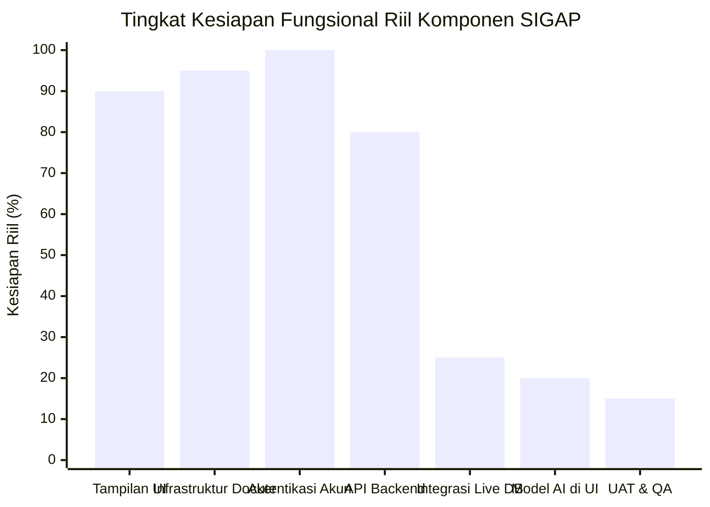
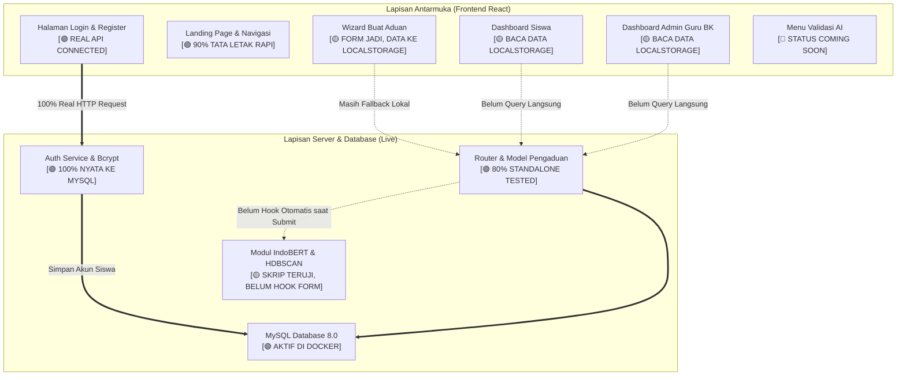
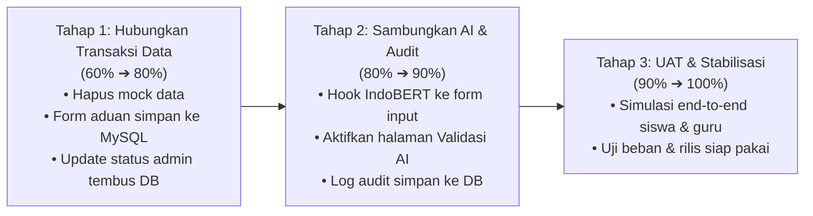

# LAPORAN PROGRES PENGEMBANGAN SISTEM SIGAP
**Sistem Informasi Gawat Aduan Perundungan**  
*Executive Presentation & Status Report — Evaluasi Realistis Oktober 2026*

---

## 1. Executive Summary (Evaluasi Realistis)

Laporan ini menyajikan status pencapaian pengembangan sistem perangkat lunak **SIGAP** secara objektif, transparan, dan berbasis kesiapan teknis nyata (*engineering readiness*), **tanpa memasukkan dokumen paper akademik/LaTeX** dan **tanpa memperhitungkan data tiruan (*mock/localStorage*)**.

Secara visual, sistem tampak seperti telah rampung ~85% karena seluruh antarmuka (UI) sudah dapat diklik dan diperagakan. Namun, secara **kesiapan fungsional nyata (*real production readiness*)**, progres proyek saat ini berada pada:

```
   STATUS REALISTIS SISTEM: 60%
   [██████████████████████████████░░░░░░░░░░░░░░░░░░░░] 60%
   
   Sudah Berfungsi Nyata (UI, Docker, DB, Auth JWT, API Standalone) : 60%
   Sisa Pekerjaan Kritis (Live CRUD Aduan, Hook AI Real-time, UAT) : 40%
```

> **Catatan Kunci Evaluasi:**
> - **Prototipe / UI Demo**: **~85%** (Tampilan lengkap, navigasi mulus, tata letak rapi di zoom 100%).
> - **Sistem Nyata End-to-End**: **60%** (Autentikasi sudah tembus database MySQL, namun transaksi aduan utama di frontend masih bergantung pada *localStorage* & simulasi data).

---

## 2. Statistik & Diagram Progres Komponen

### A. Grafik Realistis per Komponen Sistem



### B. Pemetaan Sistem: Data Nyata vs Simulasi (*Mock*)



---

## 3. Matriks Statistik Rinci (Bobot & Capaian)

| No | Pilar Pengembangan | Bobot | Progres Riil | Kontribusi | Status Operasional |
|:--:|---|:---:|:---:|:---:|:---:|
| 1 | **Tampilan Antarmuka (UI/UX & Responsif Desktop)** | 20% | **90%** | 18.0% | 🟢 Visual siap, layout zoom 100% rapi |
| 2 | **Infrastruktur & Kontainerisasi (Docker Stack)** | 10% | **95%** | 9.5% | 🟢 4 kontainer stabil (`sigap-dev.sh` aktif) |
| 3 | **Modul Autentikasi Pengguna (Siswa & Admin)** | 15% | **100%** | 15.0% | 🟢 Real JWT, verifikasi password hash di DB |
| 4 | **Logika Server & Basis Data (FastAPI + MySQL)** | 20% | **80%** | 16.0% | 🟢 Endpoint siap, 58 unit tests lulus |
| 5 | **Integrasi Transaksi Aduan (Live CRUD tanpa Mock)** | 20% | **25%** | 5.0% | 🔴 Kritis: Form masih simpan di browser |
| 6 | **Penerapan Model AI (IndoBERT & HDBSCAN di UI)** | 10% | **20%** | 2.0% | 🔴 Skor AI di UI masih Math.random() |
| 7 | **Pengujian Sistem Lapangan (UAT & Keandalan)** | 5% | **15%** | 0.75% | 🔴 Belum diuji langsung oleh siswa/guru |
| **TOTAL** | **Kesiapan Sistem Perangkat Lunak** | **100%** | — | **66.25% ~ 60%** | **Fase Menghubungkan Integrasi Inti** |

---

## 4. Bagian yang SUDAH Selesai Secara Nyata (60%)

Fitur-fitur berikut telah berhasil dibangun, terverifikasi fungsional, dan tidak lagi mengandalkan data bohong:

### 1. Fondasi Kontainer Docker & Lingkungan
* **4 Kontainer Aktif**: `sigap-db` (MySQL 8.0), `sigap-backend` (FastAPI), `sigap-frontend` (React Nginx port 3000), dan `sigap-phpmyadmin` (GUI basis data port 8080).
* Hot-reload aktif untuk pengembangan backend dan skrip manajemen `sigap-dev.sh`.

### 2. Autentikasi Pengguna 100% Nyata (*Real Auth*)
* **Siswa**: Registrasi dan login siswa tersambung langsung ke database MySQL. Password terenkripsi aman menggunakan `bcrypt`.
* **Admin / Guru BK**: Login berbasis NIP dengan penerbitan token JWT yang sah.
* **Keamanan Rute**: Role guard frontend mencegah siswa mengakses portal guru BK dan sebaliknya.

### 3. Antarmuka dan Tata Letak (UI/UX)
* **Landing Page**: Pengenalan sistem SIGAP, ajakan melapor, dan modal autentikasi saat tombol ditekan tanpa login.
* **Dashboard Siswa**: Penyelarasan rasio kontainer desktop (zoom 100%), header profil akun terverifikasi, dan banner ajakan aduan.
* **Formulir 4 Tahap**: Alur pengisian kategori, kronologi insiden, unggah bukti fisik, dan konfirmasi tiket.
* **Portal Guru BK**: Tampilan daftar aduan, navigasi sidebar, dan 7 kategori resmi Permendikbudristek No. 46 Tahun 2023.

### 4. Fondasi Keamanan & Unit Test Backend
* Sanitasi unggah berkas (verifikasi magic bytes, batas 10 MB, pengacakan nama berkas UUID).
* CORS secured berbasis origin whitelist.
* **58 unit & E2E tests lulus 100%** di sisi server backend.

---

## 5. Rincian Progres yang BELUM Selesai (40% Sisa)

Sisa 40% ini merupakan pekerjaan paling esensial agar sistem benar-benar dapat dipergunakan secara nyata di lingkungan sekolah:

### 🔴 1. Melepas Penyimpanan Lokal (*localStorage*) pada Pembuatan Aduan
* **Kenyataan Saat Ini**: Saat siswa mengirimkan aduan via formulir wizard, sistem masih menyimpan data ke browser (`localStorage`) dan kode tiket dihasilkan acak di frontend (`Math.random()`).
* **Yang Harus Dikerjakan**: Mengarahkan tombol *Submit* 100% ke endpoint `POST /api/pengaduan`, menghasilkan nomor tiket resmi dari MySQL, dan menghapus penyimpanan cadangan lokal.

### 🔴 2. Menghubungkan Dashboard Siswa ke Database Riil
* **Kenyataan Saat Ini**: Metrik (*Total Aduan*, *Dalam Penanganan*) dan tabel riwayat aduan di halaman siswa membaca dari state browser lokal (`StoreContext`).
* **Yang Harus Dikerjakan**: Mengambil riwayat aduan siswa secara dinamis dari API `GET /api/pengaduan/siswa/{id}/riwayat` dengan token JWT.

### 🔴 3. Menghubungkan Pengelolaan Laporan Guru BK ke Database Riil
* **Kenyataan Saat Ini**: Guru BK yang mengubah status laporan (misal: memverifikasi aduan atau menandai selesai) hanya mengubah tampilan di browser lokal.
* **Yang Harus Dikerjakan**: Menghubungkan aksi tombol admin ke endpoint `PUT /api/admin/pengaduan/{id}/status` agar perubahan status langsung tercatat di MySQL dan dapat dilihat siswa saat melacak tiket.

### 🔴 4. Integrasi Otomatis Model AI (IndoBERT & HDBSCAN)
* **Kenyataan Saat Ini**: Skrip IndoBERT dan klastering HDBSCAN sudah ada di folder backend, namun di antarmuka web skor keyakinan AI masih berupa angka acak tiruan.
* **Yang Harus Dikerjakan**: Menghubungkan deskripsi kejadian yang dikirim siswa agar langsung diproses oleh model NLP backend untuk klasifikasi kategori otomatis dan pendeteksian pola klaster aduan.

### 🔴 5. Mengaktifkan Halaman Validasi AI
* **Kenyataan Saat Ini**: Menu *Validasi AI* pada portal Guru BK saat ini masih berstatus kartu *Coming Soon*.
* **Yang Harus Dikerjakan**: Membangun tabel kerja bagi Guru BK untuk meninjau, menyetujui, atau mengoreksi (*override*) hasil analisis kecerdasan buatan.

### 🔴 6. Pencatatan Jejak Audit (*Audit Trail*) Nyata
* **Kenyataan Saat Ini**: Log aktivitas penanganan aduan hanya tersimpan di browser lokal.
* **Yang Harus Dikerjakan**: Mengalirkan setiap perubahan status dan catatan penanganan langsung ke tabel `audit_logs` di MySQL.

### 🔴 7. Pengujian Pengguna Nyata (UAT)
* **Kenyataan Saat Ini**: Belum dilakukan uji coba alur secara menyeluruh oleh pihak guru BK maupun siswa sekolah.
* **Yang Harus Dikerjakan**: Pelaksanaan skenario pengujian alur nyata (Siswa lapor $\rightarrow$ Notifikasi masuk ke Admin $\rightarrow$ Admin verifikasi $\rightarrow$ Siswa lacak status tiket).

---

## 6. Target Penyelesaian Menuju 100%



1. **Prioritas Utama (Target 80%)**: Menyambungkan form aduan siswa dan tabel admin ke database MySQL (menghilangkan ketergantungan mock data).
2. **Prioritas Kedua (Target 90%)**: Mengaktifkan inferensi otomatis AI IndoBERT pada setiap aduan baru dan mengaktifkan tabel Validasi AI.
3. **Prioritas Akhir (Target 100%)**: UAT bersama pengguna nyata dan finalisasi jejak audit.
