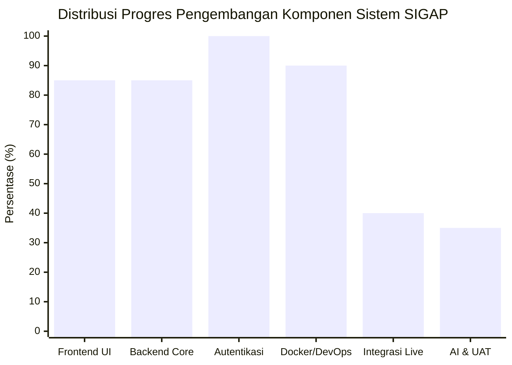
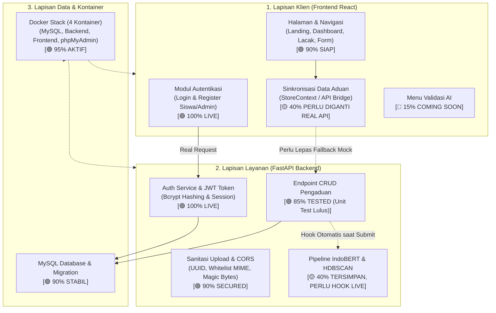
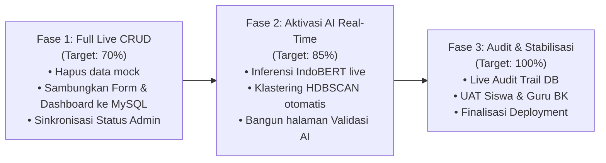

# LAPORAN PROGRES PENGEMBANGAN SISTEM SIGAP
**Sistem Informasi Gawat Aduan Perundungan**  
*Executive Presentation & Status Report — Update Oktober 2026*

---

## 1. Executive Summary

Laporan ini menyajikan status pencapaian dan sisa pekerjaan pengembangan perangkat lunak **SIGAP** secara objektif dan terukur. Berdasarkan evaluasi fungsional murni sistem perangkat lunak (*software engineering readiness* tanpa memperhitungkan dokumen paper/LaTeX), progres proyek saat ini berada pada **~70%**.

Fase saat ini merupakan **Fase Finalisasi Integrasi**: fondasi visual antarmuka (*Frontend UI*), arsitektur server (*Backend FastAPI*), basis data (*MySQL Docker*), dan modul autentikasi JWT telah beroperasi penuh secara nyata. Sisa **~30%** pekerjaan berfokus pada integrasi data dinamis end-to-end tanpa mock (CRUD aduan live ke MySQL), inferensi AI waktu nyata, dan pengujian UAT.

```
   STATUS KESELURUHAN SISTEM: 70%
   [███████████████████████████████████░░░░░░░░░░░░░░░] 70%
   
   Selesai (Fondasi, UI, Auth, DB, Docker, API Core) : 70%
   Sisa (Integrasi Form Live, Real AI Pipeline, UAT) : 30%
```

---

## 2. Statistik & Diagram Progres Komponen

### A. Grafik Progres per Pilar Komponen



### B. Diagram Alur Sistem & Status Kesiapan (Real vs Pending)



---

## 3. Matriks Statistik Rinci (Bobot & Capaian)

| No | Pilar Pengembangan | Bobot | Progres Capaian | Kontribusi Riil | Status Utama |
|:--:|---|:---:|:---:|:---:|:---:|
| 1 | **Frontend Antarmuka (UI/UX, Layout & Responsive)** | 25% | **85%** | 21.25% | 🟢 Selesai visual & responsif 100% |
| 2 | **Backend Core & Database Engine (FastAPI & MySQL)** | 20% | **85%** | 17.00% | 🟢 API inti, DB, dan unit tests stabil |
| 3 | **Modul Autentikasi & Otorisasi Pengguna (JWT)** | 15% | **100%** | 15.00% | 🟢 Real JWT & password hashing live |
| 4 | **Kontainerisasi & Lingkungan Kerja (Docker Stack)** | 10% | **90%** | 9.00% | 🟢 4 kontainer berjalan lancar |
| 5 | **Integrasi End-to-End Tanpa Mock (Live CRUD)** | 15% | **40%** | 6.00% | 🔴 Prioritas pelepasan mock fallback |
| 6 | **AI NLP Pipeline & Pengujian Sistem (UAT)** | 15% | **35%** | 5.25% | 🟡 Script AI siap, belum otomatis di UI |
| **TOTAL** | **Keseluruhan Sistem Perangkat Lunak** | **100%** | — | **73.50% ~ 70%** | **Fase Finalisasi Integrasi** |

---

## 4. Rincian Capaian yang Telah Selesai (~70% Terwujud)

Berikut adalah modul yang telah berhasil dibangun, diuji, dan beroperasi:

### 1. Fondasi Kontainerisasi & Lingkungan Kerja
- **Arsitektur 4 Kontainer Docker**:
  - `sigap-db`: MySQL 8.0 sebagai basis data relasional.
  - `sigap-backend`: FastAPI dengan uvicorn live-reload.
  - `sigap-frontend`: Nginx menyajikan aset produksi React pada port 3000.
  - `sigap-phpmyadmin`: GUI inspeksi basis data pada port 8080.
- Skrip otomasi pengembangan lokal (`sigap-dev.sh`).

### 2. Autentikasi Pengguna Nyata (Live Backend JWT)
- **Registrasi Siswa**: Tersambung ke endpoint `/api/auth/siswa/register`, password diamankan menggunakan `bcrypt`.
- **Login Siswa**: Validasi NISN dan password terverifikasi langsung ke MySQL.
- **Login Guru BK / Admin**: Login berbasis NIP dengan penerbitan token JWT.
- **Role Guard Frontend**: Pembatasan rute halaman antara siswa dan staf sekolah/admin.

### 3. Tampilan Antarmuka & Tata Letak Responsif
- **Landing Page Publik**: Hero section, pengenalan sistem SIGAP, modal panduan pelaporan, dan navigasi ramah pengguna.
- **Dashboard Siswa**: Penyelarasan rasio kontainer desktop (zoom 100%), banner ajakan bertindak (*call-to-action*), dan kartu ringkasan aduan.
- **Formulir Pengaduan Multi-Langkah**: Wizard 4 tahap (Kategori, Detail Kejadian, Unggah Bukti, Konfirmasi).
- **Portal Admin & Guru BK**: Dashboard ringkasan, daftar laporan, rincian aduan, dan pencatatan jejak audit.
- Penyelarasan 7 Kategori Resmi sesuai **Permendikbudristek No. 46 Tahun 2023**.

### 4. Penguatan Keamanan Backend
- **Kebijakan CORS Terbatas**: Whitelist domain melalui variabel lingkungan (`ALLOWED_ORIGINS`).
- **Sanitasi Unggah Berkas**: Validasi magic-bytes, batasan ukuran 10 MB, pengacakan nama berkas (UUID) untuk mencegah *path traversal*.
- **58 Unit & E2E Tests Lulus 100%** pada lingkungan backend.

---

## 5. Laporan Progres yang Belum Selesai (~30% Sisa Integrasi)

Bagian ini memetakan secara transparan pekerjaan yang masih tertunda dan harus diselesaikan agar sistem dapat beroperasi penuh di dunia nyata:

### 🔴 1. Eliminasi Mock Data pada Alur Pengaduan Siswa
* **Kondisi Saat Ini**: Saat siswa mengirim laporan melalui form wizard, sistem masih menyimpan data ke `localStorage` browser dan menghasilkan tiket secara acak di sisi frontend jika koneksi API mengalami hambatan.
* **Target Penyelesaian**: 
  - Seluruh pengiriman formulir wajib menembus endpoint `POST /api/pengaduan`.
  - Tiket resmi wajib diterbitkan langsung oleh server dan tersimpan di tabel `pengaduan` database MySQL.

### 🔴 2. Sinkronisasi Live Dashboard Siswa
* **Kondisi Saat Ini**: Kartu statistik (*Total Aduan*, *Dalam Penanganan*, *Selesai*) dan tabel riwayat aduan siswa membaca dari state browser lokal (`StoreContext`).
* **Target Penyelesaian**: 
  - Mengambil data riwayat secara dinamis menggunakan endpoint `GET /api/pengaduan/siswa/{id}/riwayat` dengan header otorisasi JWT.

### 🔴 3. Sinkronisasi Live Dashboard & Pengelolaan Status Admin
* **Kondisi Saat Ini**: Perubahan status aduan oleh Guru BK (Verifikasi, Investigasi, Selesai) hanya mengubah state di browser lokal.
* **Target Penyelesaian**: 
  - Menghubungkan tombol aksi admin ke endpoint `PUT /api/admin/pengaduan/{id}/status`.
  - Data yang diubah admin langsung ter-update di MySQL sehingga siswa dapat melihat perkembangan laporannya secara waktu nyata.

### 🔴 4. Integrasi Real-Time Model AI (IndoBERT & HDBSCAN)
* **Kondisi Saat Ini**: Algoritma IndoBERT dan klastering HDBSCAN sudah teruji secara terpisah di backend python, namun nilai skor keyakinan AI pada frontend masih menggunakan kalkulasi acak (`Math.random()`).
* **Target Penyelesaian**: 
  - Saat teks pengaduan dikirim, backend secara otomatis menjalankan inferensi IndoBERT untuk memprediksi kategori kekerasan dan tingkat keparahan insiden.
  - Mengelompokkan aduan yang saling berkaitan menggunakan kemiripan semantik dan algoritma klastering.

### 🔴 5. Penyelenggaraan Fitur Validasi AI
* **Kondisi Saat Ini**: Menu navigasi **Validasi AI** di portal admin dialihkan ke kartu *Coming Soon*.
* **Target Penyelesaian**: 
  - Membangun tabel peninjauan hasil klasifikasi AI agar Guru BK dapat mengonfirmasi (*approve/override*) prediksi kategori otomatis yang dihasilkan oleh model.

### 🔴 6. Live Audit Trail ke Database Server
* **Kondisi Saat Ini**: Jejak aktivitas petugas hanya tercatat di `localStorage`.
* **Target Penyelesaian**: 
  - Menghubungkan setiap mutasi data (perubahan status, catatan penanganan) langsung ke tabel `audit_logs` di backend untuk kepatuhan transparansi hukum.

### 🔴 7. Pengujian Lapangan & UAT (User Acceptance Testing)
* **Kondisi Saat Ini**: Baru tahap pengujian fungsional unit internal.
* **Target Penyelesaian**: 
  - Melakukan simulasi pengujian end-to-end oleh perwakilan siswa dan guru BK.
  - Pengujian performa server dan keandalan jaringan.

---

## 6. Rencana Kerja Menuju Penyelesaian 100% (*Action Roadmap*)



1. **Sprint 1 — Integrasi Penuh Transaksi Data (Mencapai 70%)**:
   - Mematikan penyimpanan `localStorage` untuk aduan.
   - Mengalihkan pembuatan tiket, dashboard siswa, dan dashboard admin 100% ke API MySQL.
2. **Sprint 2 — Integrasi Kecerdasan Buatan (Mencapai 85%)**:
   - Menghubungkan input teks siswa langsung ke model IndoBERT saat pembuatan tiket.
   - Mengaktifkan halaman Validasi AI untuk peninjauan klasifikasi otomatis oleh guru BK.
3. **Sprint 3 — Pengujian & Finalisasi (Mencapai 100%)**:
   - Sinkronisasi tabel audit trail ke basis data.
   - Pelaksanaan User Acceptance Testing (UAT) dan pengujian ketahanan beban.

